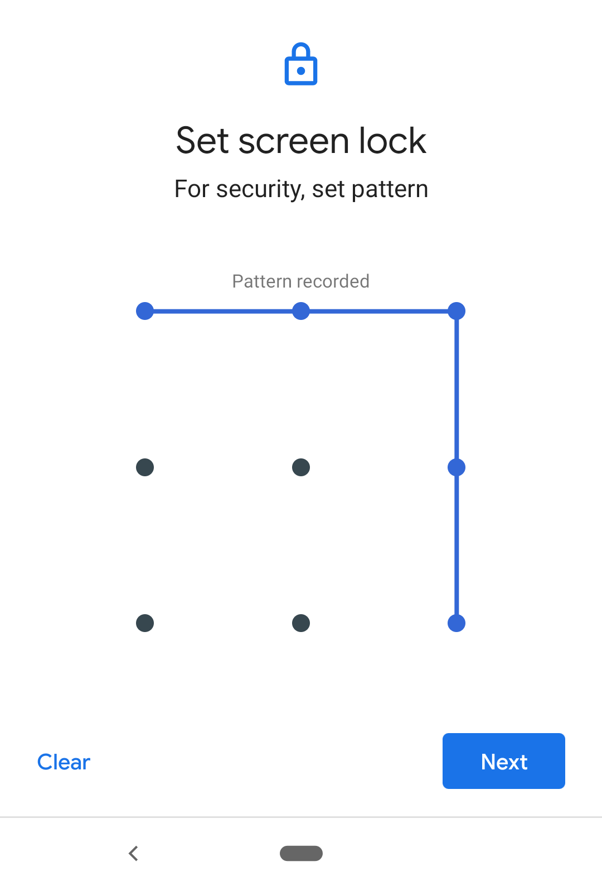
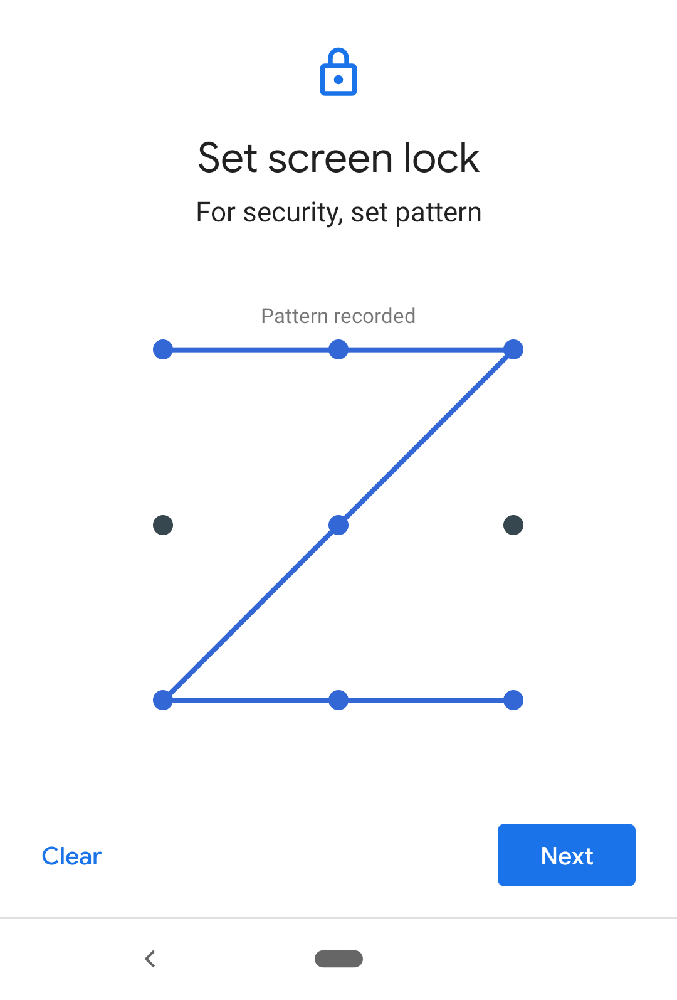

APC: Android (Unlock) Pattern Classifier
========================================

<div align="left">



</div>

### tl;dr
APC is a classifier for Android unlock patterns written in [Kotlin](https://developer.android.com/kotlin).
It calculates scores derived from visual properties that are used by various Android unlock pattern strength meters to estimate the strength, also known as guessability, of a given pattern.

### Paper: On the In-Accuracy and Influence of Android Pattern Strength Meters
If you are interested in the details on how accurate, current Android unlock pattern strength meter proposals are and how a Markov model-based pattern strength meter improves on their accuracy, please refer to our paper: [On the In-Accuracy and Influence of Android Pattern Strength Meters](https://www.mobsec.ruhr-uni-bochum.de/forschung/veroeffentlichungen/accuracy-android-pattern-strength-meters/).

### The Android (Unlock) Pattern Classifier
Implementing Android unlock pattern strength meters is a challenging and error-prone process. To foster future research on this topic, we decided to publish our implementation. Our implementation supports a long list of visual features, and currently supports the following three Android unlock pattern strength meters proposed in the literature:
* Andriotis et al. - 2014 - [Complexity Metrics and User Strength Perceptions of the Pattern-Lock Graphical Authentication Method](https://link.springer.com/chapter/10.1007/978-3-319-07620-1_11)
* Sun et al. - 2014 - [Dissecting Pattern Unlock: The Effect of Pattern Strength Meter on Pattern Selection](https://www.sciencedirect.com/science/article/abs/pii/S2214212614001458)
* Song et al. - 2015 - [On the Effectiveness of Pattern Lock Strength Meters: Measuring the Strength of Real World Pattern Locks](https://dl.acm.org/doi/10.1145/2702123.2702365)

#### Features
  * Verifying patterns for their validity (detect data collection issues)
  * Calculating scores based on visual pattern properties like
    * `1A: Starting Nodes`
    * `1B: Minimum Length`
    * `1C: Direction Changes`
    * `1D: Knight Moves`
    * `1E: Overlapping Nodes`
    * `2A: Length`
    * `2B: Physical Length`
    * `2C: Intersections`
    * `2D: Overlapping Segments`
    * `3A: Length in Maximum Norm`
    * `3B: Intersections (Restricted)`
    * `3C: Ratio of Non-Repeated Segments`
  * Support for three Android unlock pattern strength meters proposed in the literature (see above)
  * Support for larger grid sizes than 3x3, e.g., [4x4](https://dl.acm.org/doi/10.1145/2818000.2818014)
  * Support to evaluate single patterns (`-p`) or text files containing a list of patterns (`-f`)
  * Support for custom delimiters different from ".", e.g., `0124678` instead of `0.1.2.4.6.7.8`

### User Guide

You can choose to use the results published in `results/results.csv`, or you can run the software on your own.
The APC software requires [Java](https://www.oracle.com/java/technologies/javase-downloads.html).

You can query the strength of a single pattern via:

`$ java -jar apc.jar -p 0.1.2.5.8`

If you like to evaluate a list of patterns, you can provide a text file that contains them (one per line):

`$ java -jar bin/apc.jar -f data/sample.txt andriotis sun song`

```
[Pattern]         [Count] [Validity] [Andriotis et al.] [Sun et al.]         [Song et al.]
 0.1.2.5           1       VALID      0                  6.339850002884625    0.1886666666666667
 0.3.6.7           1       VALID      0                  6.339850002884625    0.1886666666666667
 0.1.2.5.8         1       VALID      0                  10.0                 0.236
 0.3.6.7.8         1       VALID      0                  10.0                 0.236
 0.3.6.7.8.5       1       VALID      2                  13.931568569324174   0.286
 0.3.6.7.8.5.2     1       VALID      3                  18.094737505048094   0.3373333333333334
 0.1.2.4           1       VALID      0                  7.086213212654448    0.1886666666666667
 6.3.0.1           1       VALID      1                  6.339850002884625    0.1886666666666667
 2.1.0.3           1       VALID      1                  6.339850002884625    0.1886666666666667
 0.1.2.5.8.7.6.3   1       VALID      4                  22.458839376460833   0.3894285714285715
...
```

### Source Code

We recommend using the [IntelliJ IDEA](https://www.jetbrains.com/idea/) Java Integrated Development Environment (IDE).
Below is a list of the currently supported features, min/max value, and data type.

```
ID    Feature                                       Example for 3x3 Grid (Min. .. Max.)                 Data Type
--    pattern                                       0.1.2.3 - 8.7.6.5.4.3.2.1.0                         (STR)
--    count                                         [1,..,-]                                            (INT)
--    validity                                      [INVALID,VALID]                                     (STR)

1A    [andriotis-node-index]                        [0,1]                                               (INT)
1B    [andriotis-length]                            [0,1,2,3,4]                                         (INT)
1C    [andriotis-direction-changes,
       andriotis-turns]                             [0,1]                                               (INT)
1D    [andriotis-knight-moves,
       knight-moves,
       k-moves]                                     [0,1,2,3,4,5,6,7]                                   (INT)
1E    [andriotis-overlapping-nodes,
       overlapping-nodes,
       revisited-nodes,
       revisited-points,
       non-adjacent]                                [0,1,2,3,4,5]                                       (INT)
1F    [andriotis,
       andriotis-raw,
       andriotis-r]                                 [0,1,2,3,4,5,6,7,8,9,10,11,12,13]                   (INT)
1G    [andriotis-quantized,
       andriotis-q]                                 [1,2,3]                                             (INT)
--    [andriotis-normalized,
       andriotis-n]                                 0.0 .. 1.0                                          (FLOAT)
--    [andriotis-quantized-normalized,
       andriotis-qn]                                [1,3,5]                                             (INT)

2A    [sun-length,
       node-length,
       point-length,
       pattern-length]                              [4,5,6,7,8,9]                                       (INT)
2B    [sun-physical-length,
       physical-length,
       sum-of-euclidean-distance,
       euclidean-distance]                          3.0 .. 17.7792717444                                (FLOAT)
2C    [sun-intersections,
       all-intersections]                           [0,1,2,3,4,5,6,7,8,9,10,11,12,13,14,15,16,17,18]    (INT)
2D    [sun-overlapping-segments,
       overlapping-segments]                        [0,1,2,3]                                           (INT)
2E    [sun,
       sun-raw,
       sun-r]                                       6.33985000288 .. 46.8073890768                      (FLOAT)
2F    [sun-quantized,
       sun-q]                                       [1,2,3,4,5]                                         (INT)
--    [sun-normalized,
       sun-n]                                       0.0 .. 1.0                                          (FLOAT)
--    [sun-quantized-normalized,
       sun-qn]                                      [1,2,3,4,5]                                         (INT)

3A    [song-length,
       song-length-in-maximum-norm,
       song-maximum-norm,
       song-maximum-norm-length,
       length-in-maximum-norm,
       maximum-norm-length,
       maximum-norm,
       sum-of-max-horizontal-or-vertical-distance,
       max-horizontal-or-vertical-distance]         [3,4,5,6,7,8,9,10,11,12,13,14,15]                   (INT)
3B    [song-intersections]                          [0,1,2,3,4,5,6,7,8,9,10,11,12,13,14,15]             (INT)
3C    [song-ratio-of-non-repeated-segments,
       ratio-of-non-repeated-segments,
       non-repeated-segments,
       non-repeated]                                0.25 .. 1.0                                         (FLOAT)
3D    [song,
       song-raw,
       song-r]                                      0.175333333333 .. 0.99                              (FLOAT)
3E    [song-quantized,
       song-q]                                      [1,2,3]                                             (INT)
--    [song-normalized,
       song-n]                                      0.0 .. 1.0                                          (FLOAT)
--    [song-quantized-normalized,
       song-qn]                                     [1,3,5]                                             (INT)

--    [start-node-index,
       start-point-index,
       start-index]                                 [0,1,2,3,4,5,6,7,8]                                 (INT)
--    [direction-changes, turns]                    [1,2,3,4,5,6,7]                                     (INT)
--    [non-repeated-palindrome]                     0.0 .. 0.875                                        (FLOAT)

```

### License

**APC: Android (Unlock) Pattern Classifier** is licensed under the MIT license. Refer to [docs/LICENSE](docs/LICENSE) for more information.

### Contact
Visit our [website](https://www.mobsec.rub.de) and follow us on [Twitter](https://twitter.com/hgi_bochum). If you are interested in passwords, consider to contribute and to attend the [International Conference on Passwords (PASSWORDS)](https://passwordscon.org).
